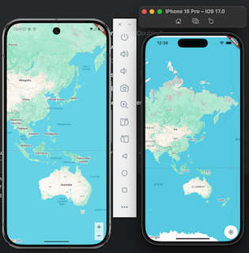

# Chool Check - 오늘도 출첵

## Goals
- Geolocator
- Google Maps
- Marker
- Circle
- Stream
- FutureBuilder
- Permission

### Tips
- 특정 파일 Changes 추적 X
```shell
git update-index --skip-worktree android/app/src/main/AndroidManifest.xml ios/Runner/AppDelegate.swift
```
- 이후에 추적하고 싶다면
```shell
git update-index --no-skip-worktree android/app/src/main/AndroidManifest.xml ios/Runner/AppDelegate.swift
```

### Google Maps API Key
AIz...

### Put that API Key
- android: `./android/app/src/main/AndroidManifest.xml`
- append
```xml
<manifest xmlns:android="http://schemas.android.com/apk/res/android">
    ..
    <application
        android:label="chool_check"
        ..
        <activity
            ..
            <meta-data
              android:name="io.flutter.embedding.android.NormalTheme"
              android:resource="@style/NormalTheme"
              />
            <intent-filter>
                <action android:name="android.intent.action.MAIN"/>
                <category android:name="android.intent.category.LAUNCHER"/>
            </intent-filter>
        </activity>
        <meta-data
            android:name="flutterEmbedding"
            android:value="2" />
        <meta-data android:name="com.google.android.geo.API_KEY"
            android:value="[API KEY]"/>
    </application>
    ..
</manifest>
```

- ios: `./ios/Runner/AppDelegate.swift`
- append
```swift
import UIKit
import Flutter
import GoogleMaps

@main
@objc class AppDelegate: FlutterAppDelegate {
  override func application(
    _ application: UIApplication,
    didFinishLaunchingWithOptions launchOptions: [UIApplication.LaunchOptionsKey: Any]?
  ) -> Bool {
    GMSServices.provideAPIKey("[API KEY]")
    GeneratedPluginRegistrant.register(with: self)
    return super.application(application, didFinishLaunchingWithOptions: launchOptions)
  }
}
```

### HotFix
- problem
```text
Error: The plugin "google_maps_flutter_ios" requires a higher minimum iOS deployment version than your application is targeting. 
To build, increase your application's deployment target to at least 14.0 as described at
```
- to solve
```shell
cd ios
```
```text
fix # platform :ios, '13.0' 
platform :ios, '14.0'
```
```shell
pod install --repo-update
```

### Permissions
- android: `./android/app/src/main/AndroidManifest.xml`
```xml
<manifest ..>
    <uses-permission android:name="android.permission.ACCESS_FINE_LOCATION" />
    <uses-permission android:name="android.permission.ACCESS_COARSE_LOCATION" />
```

- ios: `./ios/Runner/Info.plist`
```xml
<?xml version="1.0" encoding="UTF-8"?>
<!DOCTYPE plist PUBLIC "-//Apple//DTD PLIST 1.0//EN" "http://www.apple.com/DTDs/PropertyList-1.0.dtd">
<plist version="1.0">
    <dict>
        ...
        <key>NSLocationWhenInUseUsageDescription</key>
        <string>지도에서 현재 위치를 확인하기 위해 필요합니다.</string>
        <key>NSLocationAlwaysUsageDescription</key>
        <string>지도에서 현재 위치를 확인하기 위해 필요합니다.</string>
        <key>UIBackgroundModes</key>
        <array>
            <string>location</string>
        </array>
    </dict>
</plist>
```

### Google Maps
- korea  
