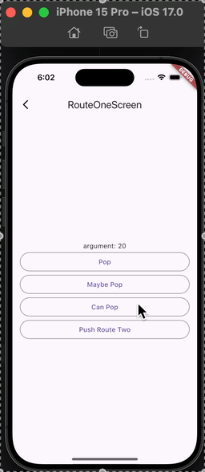

# Navigation Theory

## Study
- Layout
- AppBar
- Pass arguments: Navigator, RouteSettings
- Imperative vs Declarative
- pushNamed
- pushReplacement, pushReplacementNamed
- pushNamedAndRemoveUntil
- maybePop
- canPop
- PopScope

