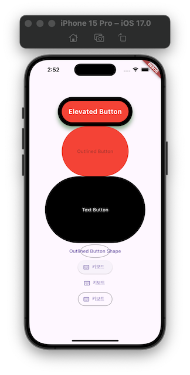

# Button Theory

## Study
- Basic Button Types
- ElevatedButton
- OutlinedButton
- TextButton
- MaterialStateProperty.all()
- MaterialStateProperty.resolveWith()
- Shape
- IconButton

## Tips
- ElevatedButton, OutlinedButton, TextButton 모두 다 같은 styleFrom을 적용 가능하다.
- MaterialStateProperty: deprecated => WidgetStateProperty
- WidgetStateProperty.all(): 모든 상황에 동일 스타일링 적용
- WidgetStateProperty.resolveWith(): 특정 상태마다 스타일링 각각 적용
- styleFrom 함수는 ButtonStyle을 결국 반환한다.
- WidgetState
  - hovered - 호버링 상태 (마우스 커서를 올려놓은 상태)
  - focused - 포커스 됐을 때 (텍스트 필드)
  - pressed - 눌렀을 때 [o]
  - dragged - 드래그 됐을 때
  - selected - 선택 됐을 때 (체크박스, 라디오 버튼)
  - scrollUnder - 다른 컴포넌트 밑으로 스크롤링 됐을 때
  - disabled - 비활성화 됐을 때 [o]
  - error - 에러 상태일 때
- XXXButton.icon()으로 IconButton을 만들 수 있다.

