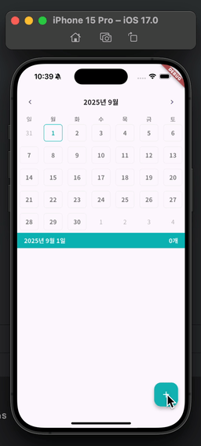

# Calendar Scheduler

## Goals
- Table Calendar
- IntrinsicWidget
- FloatingActionButton
- BottomSheet
- Form
- TextFormField
- ListView(builder, separated)
- Drift
- Dismissible - onDismissed, confirmDismiss
- DI(Dependency Injection) - get_it

---



---
## Drift
```dart
part 'drift.g.dart';

class AppDateBase extends _$AppDateBase {
  //..
}
```

- terminal
```shell
  dart run build_runner build
```

---

## Drift Migration
- add new field
```dart
import 'package:drift/drift.dart';

class CategoryTable extends Table {
  IntColumn get id => integer().autoIncrement()();

  TextColumn get color => text()();

  /// 새로운 필드
  IntColumn get randomNumber => integer()();

  DateTimeColumn get createdAt => dateTime().clientDefault(
        () => DateTime.now().toUtc(),
  )();
} 
```

- terminal
```shell
  dart run build_runner build
```

- AppDateBase
```dart
import 'dart:io';
import 'package:calendar_scheduler/model/category.dart';
import 'package:calendar_scheduler/model/schedule.dart';
import 'package:calendar_scheduler/model/schedule_with_category.dart';
import 'package:drift/drift.dart';
import 'package:drift/native.dart';
import 'package:path_provider/path_provider.dart';
import 'package:path/path.dart' as p;
import 'package:sqlite3/sqlite3.dart';

part 'drift.g.dart';

@DriftDatabase(
  tables: [
    ScheduleTable,
    CategoryTable,
  ],
)
class AppDateBase extends _$AppDateBase {
  AppDateBase() : super(_openConnection());

  // Queries
  
  Future<List<ScheduleTableData>> getSchedules(
    DateTime date,
  ) => (select(scheduleTable)..where((table) => table.date.equals(date))).get();

  Stream<List<ScheduleWithCategory>> streamSchedules(
    DateTime date,
  ) {
    // ..
    final query = select(scheduleTable).join(
      [
        innerJoin(
          categoryTable,
          categoryTable.id.equalsExp(scheduleTable.colorId),
        ),
      ],
    )..where(scheduleTable.date.equals(date));

    return query.map((row) {
      final schedule = row.readTable(scheduleTable);
      final category = row.readTable(categoryTable);

      return ScheduleWithCategory(
        category: category,
        schedule: schedule,
      );
    }).watch();
  }

  @override
  int get schemaVersion => 2; /// 해당 부분 수정

  @override
  MigrationStrategy get migration {
    return MigrationStrategy(
      onUpgrade: (Migrator m, int from, int to) async {
        /// 아래 코드 추가 or 수정
        if (from < 2) {
          await m.addColumn(categoryTable, categoryTable.randomNumber);
        }
      },
    );
  }
}

LazyDatabase _openConnection() {
  return LazyDatabase(() async {
    final dbFolder = await getApplicationDocumentsDirectory();
    final file = File(p.join(dbFolder.path, 'db.sqlite'));
    final cacheDatabase = await getTemporaryDirectory();

    sqlite3.tempDirectory = cacheDatabase.path;

    return NativeDatabase.createInBackground(file);
  });
}

```

---
## Debugging
#### 1. Native 플러그인 미설치
```text
[ERROR:flutter/runtime/dart_vm_initializer.cc(40)] Unhandled Exception: MissingPluginException(No implementation found for method getApplicationDocumentsDirectory on channel plugins.flutter.io/path_provider)
```
=> Native Plugin이 설치되지 않은 것이므로 Flutter 종료 후 재시작 또는 앱 삭제 후 재설치

#### 2. Class Name 충돌(Flutter Column / drift's Column)
```text
'Column' isn't a function. (Documentation)

Try correcting the name to match an existing function, or define a method or function named 'Column'.
The name 'Column' is defined in the libraries 'package:drift/src/dsl/dsl.dart (via package:drift/drift.dart)' and 'package:flutter/src/widgets/basic.dart (via package:flutter/material.dart)'. (Documentation)

Try using 'as prefix' for one of the import directives, or hiding the name from all but one of the imports.
```
=> as 키워드 또는 hide 키워드를 통해 해결 가능
```dart
// before
import 'package:drift/drift.dart';
// after
import 'package:drift/drift.dart' hide Column;
```

#### 3. Migration시 Not NULL 컬럼(필드) 주의
```text
[ERROR:flutter/runtime/dart_vm_initializer.cc(40)] Unhandled Exception: SqliteException(1): while executing, Cannot add a NOT NULL column with default value NULL, SQL logic error (code 1)
  Causing statement: ALTER TABLE "category_table" ADD COLUMN "random_number" INTEGER NOT NULL;, parameters: 
```
문제의 코드
```dart
IntColumn get randomNumber => integer()();
```

해결 방법 2가지
```dart
class CategoryTable extends Table {
  IntColumn get id => integer().autoIncrement()();

  TextColumn get color => text()();

  /// default value
  IntColumn get randomNumber => integer().withDefault(const Constant(0))();

  /// nullable
  IntColumn get randomNumber2 => integer().nullable()();

  DateTimeColumn get createdAt => dateTime().clientDefault(
        () => DateTime.now().toUtc(),
  )();
}
```
=> 컬럼 추가시에는 기본값 지정해주거나 nullable로 처리하기